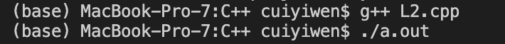

# C++ for beginner

Finding good resources is always the starting point of success for beginner programmer. The below tutorial is really helpful FOR ME to understand the mechanism of C++. 



#### Compile C++ in IDE

from source file \(programmer code\) to executable file \(machine code\). compiling whole source file at a time, which is able to detect bug once it compile, reducing the risk of having type error.

#### Namespace

using namespace std;   
using std::cout / using std::cin;   
These prefix is to avoid name conflicts

#### Conventions and style guide

comments: // \(single line\) /\*,\*/ \(multiple lines\)  
variable case sensitive eg: SLICE is not slice

#### Main function, customized functions, void functions

Main function: like a control center of the whole programming. should call functions from main function  
Customized functions: declare and define before main function.  
Void functions: without returning a value  

#### C string \(character array\) and string class

c string declaration: char a\[5\] ="Yiwen"

| a\[1\] | a\[2\] | a\[3\] | a\[4\] | a\[5\] | a\[6\] |
| :--- | :--- | :--- | :--- | :--- | :--- |
| Y | i | w | e | n | \0 |

string class declaration:

std::string a="Yiwen"

#### For loop/while loop \(continue and break\)

Break: jump out of the loop  
continue: go to next iteration

